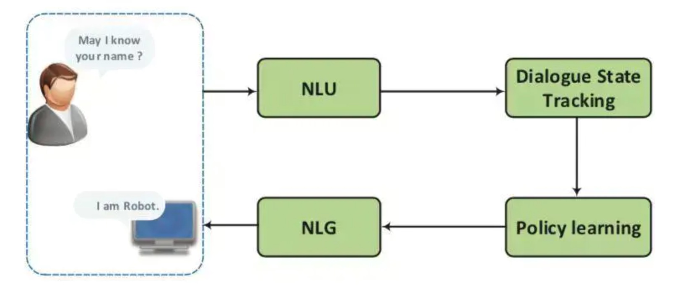
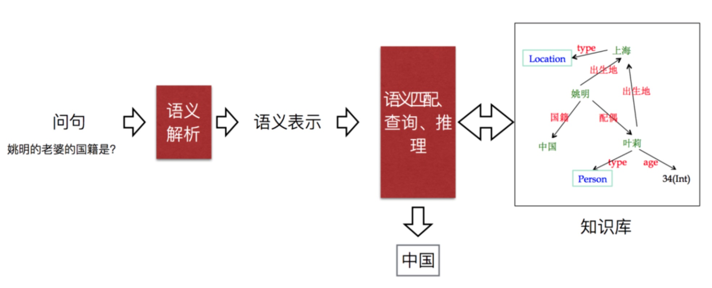
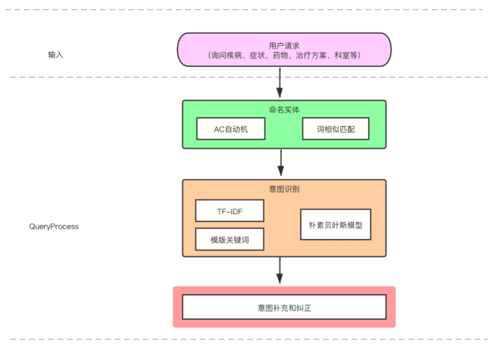
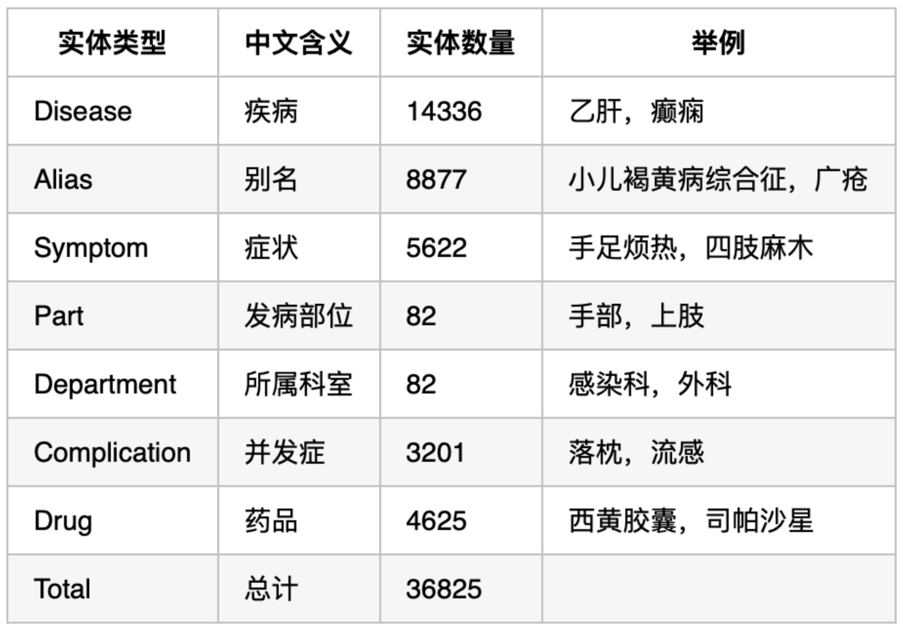
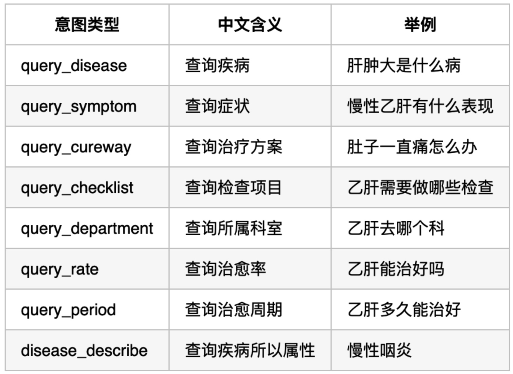

# 1. 介绍

​		在[Task3](https://github.com/LemonRay/Datawhale-KnowledgeGraph-learning/blob/main/Task3-Neo4j%E5%9B%BE%E6%95%B0%E6%8D%AE%E5%BA%93%E5%AF%BC%E5%85%A5%E6%95%B0%E6%8D%AE.md)中，我们完成了将文件中保存的实体、关系数据导入Neo4j数据库的工作，构建了知识图谱。我们不能直接使用用户输入去Neo4j数据库中进行查询，还需要**将用户输入问答系统的自然语言转化成知识库的查询语句**。Task4中将会完成这一部分功能。本文参考[Datawhale 知识图谱组队学习 之 Task 4](https://github.com/datawhalechina/team-learning-nlp/blob/master/KnowledgeGraph_Basic/task04.md#%E4%B8%80%E5%BC%95%E8%A8%80)


# 2. 什么是问答系统

## 2.1 问答系统简介

问答系统(Question Answering System，QA System)是用来回答人提出的自然语言问题的系统。根据划分标准不同，问答系统可以被分为各种不同的类型。

- 问答系统从知识领域划分：

  - 封闭领域：封闭领域系统专注于回答特定领域的问题，由于问题领域受限，系统有比较大的发挥空间，**可以导入领域知识或将答案来源全部转换成结构性资料来有效提升系统的表现**；
  - 开放领域：开放领域系统则希望不设限问题的内容范围，因此其**难度也相对较大**。

- 问答系统从实现方式划分：

  - 基于流水线（pipeline）实现：如下图 1 所示，基于流水线实现的问答系统有四大核心模块，分别由**自然语言理解（NLU）**、**对话状态跟踪器（DST）**、**对话策略（DPL）**和**自然语言生成（NLG）**依次串联构成的一条流水线，各模块可独立设计，模块间协作完成任务。

  - 基于端到端（end-to-end）实现：基于端到端实现的问答系统，主要是结合深度学习技术，通过海量数据训练，挖掘出从用户自然语言输入到系统自然语言输出的整体映射关系，而忽略中间过程的一种方法。但就目前工业界整体应用而言，**工业界的问答系统目前大多采用的还是基于流水线实现的方式**。

    > 那我们如何理解端到端呢？
    > 答：端到端学习是一种解决问题的思路，与之对应的是多步骤解决问题，也就是将一个问题拆分为多个步骤分步解决，而端到端是由输入端的数据直接得到输出端的结果。端到端模型就是将可以多步骤/模块解决的任务使用单个模型来建模解决，一般在深度学习中比较常见。参考[请问“端到端机器学习”中的“端到端”应如何理解？](https://www.zhihu.com/question/264358398/answer/280773231)和[机器学习中端到端学习的本质是什么？有什么优缺点？](https://www.zhihu.com/question/349900338/answer/851434329)

- 问答系统从答案来源划分：

  - 「知识库问答」。是目前的研究热点。知识库问答（knowledge base question answering, KB-QA）即给定自然语言问题，通过对问题进行语义理解和解析，进而利用知识库进行查询、推理得出答案。如下图 2 所示：
  - 「常问问题问答」；
  - 「新闻问答」；
  - 「网际网路问答」；

<center>        <br>    <div style="color:orange; border-bottom: 1px solid #d9d9d9;    display: inline-block;    color: #999;    padding: 2px;">图1 基于pipeline实现的问答系统</div> </center>


<center>        <br>    <div style="color:orange; border-bottom: 1px solid #d9d9d9;    display: inline-block;    color: #999;    padding: 2px;">图2 知识库问答的问答系统</div> </center>

## 2.2 Query理解

​		Query就是“问题”，即当前用户输入问答系统的自然语言。我们需要对Query做一系列处理。Query理解 (QU，Query Understanding)，简单来说就是从词法、句法、语义三个层面对 Query 进行结构化解析。

​		搜索 Query 理解包含的模块主要有：

- Query预处理

- Query纠错

- Query扩展

- Query归一

- 意图识别

- 槽值填充

- Term重要性分析；

- ......

  由于本任务后面代码主要涉及意图识别和槽位解析，因此这里仅对这两部分内容做介绍。

### 2.2.1 意图识别

1. 介绍：

   意图识别是用来检测用户当前输入的意图，如图3所示，**通常其被建模为**将一段自然语言文本分类为预先设定的一个或多个意图的**文本分类任务**。

2. 所用方法和文本分类模型的方法大同小异，主要有：

   - 基于词典模板的规则分类
   - 传统的机器学习模型（文本特征工程+分类器）
   - 深度学习模型（Fasttext、TextCNN、BiLSTM + Self-Attention、BERT等）

<center>        <br>    <div style="color:orange; border-bottom: 1px solid #d9d9d9;    display: inline-block;    color: #999;    padding: 2px;">图3 意图识别</div> </center>

### 2.2.2 槽值填充

1. 介绍：

   槽值填充就是根据我们既定的一些结构化字段，将用户输入的信息中与其对应的部分提取出来。因此，**槽值填充经常被建模为序列标注的任务**。

2. 举例介绍：

   例如图4所示的 Query "北京飞成都的机票"，通过意图分类模型可以识别出 Query 的整体意图是订机票，在此基础上进一步语义解析出对应的出发地 Depart="北京"，到达地 Arrive="成都"，所以生成的形式化表达可以是：Ticket=Order(Depart,Arrive)，Depart={北京}，Arrive={成都}。

3.  序列标注的任务常用的模型有：

   - 词典匹配；
   - BiLSTM + CRF；
   - IDCNN
   - BERT等。

<center>        <br>    <div style="color:orange; border-bottom: 1px solid #d9d9d9;    display: inline-block;    color: #999;    padding: 2px;">图4 槽值填充</div> </center>


# 3. 问答系统任务实践

​		[Task2](https://github.com/LemonRay/Datawhale-KnowledgeGraph-learning/blob/main/Task2-%E5%9F%BA%E4%BA%8E%E5%8C%BB%E7%96%97%E7%9F%A5%E8%AF%86%E5%9B%BE%E8%B0%B1%E7%9A%84%E9%97%AE%E7%AD%94%E7%B3%BB%E7%BB%9F%E6%93%8D%E4%BD%9C%E4%BB%8B%E7%BB%8D.md)介绍了一个基于知识图谱的问答系统，源项目地址为[QASystemOnMedicalGraph](https://github.com/zhihao-chen/QASystemOnMedicalGraph)。

## 3.1 系统框架

​		系统的Query处理部分可以大体分为三部分内容：命名实体识别、意图识别、意图补充和纠正。其中命名实体识别和意图识别将分别在第4章和第5章中介绍。

<center>        <br>    <div style="color:orange; border-bottom: 1px solid #d9d9d9;    display: inline-block;    color: #999;    padding: 2px;">图5 基于知识图谱的问答系统框架</div> </center>

## 3.2 主体类 EntityExtractor 介绍

​		在[QASystemOnMedicalGraph](https://github.com/zhihao-chen/QASystemOnMedicalGraph)项目中，想要启动问答测试需要运行`kbqa_test.py`文件。`kbqa_test.py`会构建`EntityExtractor`类的实例，并调用`EntityExtractor`类中的`extractor`函数完成命名实体的抽取和意图识别的功能。

### 3.2.1 主体类 EntityExtractor 框架

​		本节对类 `EntityExtractor` 中的各函数的功能做了大致介绍。

```
lass EntityExtractor:
    def __init__(self):
        pass

    # 构造actree，加速过滤
    def build_actree(self, wordlist):
        pass
        
    # 模式匹配, 得到匹配的词和类型。如疾病，疾病别名，并发症，症状
    def entity_reg(self, question):
        pass

    # 当全匹配失败时，就采用相似度计算来找相似的词
    def find_sim_words(self, question):
        pass

    # 采用DP方法计算编辑距离
    def editDistanceDP(self, s1, s2):
        pass

    # 计算词语和字典中的词的相似度
    # 相同字符的个数/min(|A|,|B|)   +  余弦相似度
    def simCal(self, word, entities, flag):
        pass

    # 基于特征词分类
    def check_words(self, wds, sent):
        pass

    # 提取问题的TF-IDF特征
    def tfidf_features(self, text, vectorizer):
        pass

    # 提取问题的关键词特征
    def other_features(self, text):
        pass

    # 预测意图
    def model_predict(self, x, model):
        pass

    # 实体抽取主函数
    def extractor(self, question):
        pass
```


### 3.2.2 实体抽取主函数的工作流程

def extractor(self, question)：

这是实体抽取主函数，分为模式匹配、意图预测、意图补充这三部分内容。

（1）先进行模式匹配（命名实体识别）。调用`entity_reg(question)`，对question进行模式匹配, 得到匹配的词和类型。如疾病，疾病别名，并发症，症状。若全匹配失败，则调用 `find_sim_words(question)` ，通过相似度来找相似的词。

（2）然后进行意图预测。

​		①调用`tfidf_features(question, self.tfidf_model)`，提取query的TF-IDF特征。

​		②调用`other_features(question)`，提取query的关键词特征。

​		③将query的TF-IDF特征向量与关键词特征向量合并，得到query的综合特征。

​		④调用`model_predict(feature, self.nb_model)`，根据query的综合特征预测意图。

（3）最后进行意图补充。调用`check_words(wds, question)`，基于wds对question分类，对意图进行补充。


# 4. 命名实体识别

## 4.1 命名实体识别整体思路介绍

- step 1：对于用户的输入，先使用预先构建的疾病、疾病别名、并发症和症状的AC Tree进行匹配；
- step 2：若全都无法匹配到相应实体，则使用jieba切词库对用户输入的文本进行切分；
- step 3：然后将每一个词都去与疾病词库、疾病别名词库、并发症词库和症状词库中的词计算相似度得分（overlap score、余弦相似度分数和编辑距离分数），如果相似度得分超过0.7，则认为该词是这一类实体；
- step 4：最后排序选取最相关的词作为实体（项目所有的实体类型如下图所示，但实体识别时仅使用了疾病、别名、并发症和症状四种实体）

系统中所涉及的实体如图6所示。

<center>        <br>    <div style="color:orange; border-bottom: 1px solid #d9d9d9;    display: inline-block;    color: #999;    padding: 2px;">图6 实体类型</div> </center>

​		

## 4.2 涉及函数的介绍

1. build_actree 函数

   该函数在`__init__(self)`中调用，目的是构造领域actree。

2. entity_reg 函数

   （1）函数功能：模式匹配, 得到匹配的词和类型。如疾病，疾病别名，并发症，症状

   （2）工作原理：将query与构造的ACTree进行匹配

3. find_sim_words 函数

   （1）函数功能：若调用entity_reg 函数后发现，query全都无法匹配到相应实体，则调用find_sim_words 函数。

   （2）工作原理：
   		①先使用jieba切词库对用户输入的文本进行切分；

   ​		②调用`simCal(word, temp[i], flag)`，将每一个词都去与疾病词库、疾病别名词库、并发症词库和症状词库中的词计算相似度得分


# 5. 意图识别

## 5.1 意图识别整体思路介绍

- step 1：利用TF-IDF表征文本特征，同时构建一些人工特征（每一类意图常见词在句子中出现的个数）；
- step 2：训练朴素贝叶斯模型进行意图识别任务；
- step 3：使用实体信息进行意图的纠正和补充。

系统中所涉及的意图如图7所示。该项目通过手工标记210条意图分类训练数据，并采用朴素贝叶斯算法训练得到意图分类模型。其最佳测试效果的F1值达到了96.68%。

<center>        <br>    <div style="color:orange; border-bottom: 1px solid #d9d9d9;    display: inline-block;    color: #999;    padding: 2px;">图7 意图类型</div> </center>

